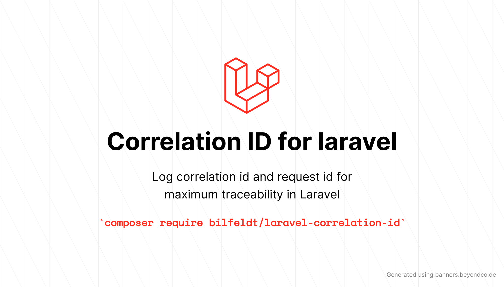

# Deal with Request-ID and Correlation-ID in Laravel applications



[](https://packagist.org/packages/bilfeldt/laravel-correlation-id)
[](https://github.com/bilfeldt/laravel-correlation-id/actions/workflows/run-tests.yml)
[](https://github.styleci.io/repos/692023533/shield)
[](https://packagist.org/packages/bilfeldt/laravel-correlation-id)

Create request Correlation-IDs via middleware and pass both this globally unique `Correlation-ID` and any user provided `Request-ID` to the global log context.

| Version | Laravel      | PHP                              |
|---------|--------------|----------------------------------|
| 1.*     | 10.* \| 11.* | 8.1.* \| 8.2.* \| 8.3.* \| 8.4.* |

## Motivation

Each and every request should have a unique _Correlation ID_ which uniquely determines the user interaction. This _Correlation ID_ should then be added to all log entries as context, to error reporting and to any subsystem like external API calls or queued jobs. Doing so, makes is possible to track relevant touch points for a given user request. Read more [here](https://microsoft.github.io/code-with-engineering-playbook/observability/correlation-id/).

A client can also provide a _Request ID_ which it is good practice to return again in the response and correlate to the _Correlation ID_. Read more [here](https://http.dev/x-request-id).

## Installation

You can install the package via composer:

```bash
composer require bilfeldt/laravel-correlation-id
```

### Assigning Correlation ID to requests

> [!NOTE]
> Ideally, the unique Correlation ID should be created at the **very first touch point** of your infrastructure like the initial server which could be a load balancer

As it can be tricky to create _Correlation ID_ on the server level and this is so easy in Laravel using middleware. This package provides a middleware for creating a _Correlation ID_ and attaching it to the request as a header `Correlation-ID` and to the response header as well. You should either assign the correlation id on the first touch point of your infrastructure or register the `CorrelationIdMiddleware` middleware globally as the first middleware in the `$middleware` property of your `app/Http/Kernel.php` class:

```php
// app/Http/Kernel.php

/**
 * The application's global HTTP middleware stack.
 *
 * These middleware are run during every request to your application.
 *
 * @var array<int, class-string|string>
 */
protected $middleware = [
    \Bilfeldt\CorrelationId\Middleware\CorrelationIdMiddleware::class, // <!-- Add this globally as the first toutchpoint
    // \App\Http\Middleware\TrustHosts::class,
    \App\Http\Middleware\TrustProxies::class,
    \Illuminate\Http\Middleware\HandleCors::class,
    \App\Http\Middleware\PreventRequestsDuringMaintenance::class,
    \Illuminate\Foundation\Http\Middleware\ValidatePostSize::class,
    \App\Http\Middleware\TrimStrings::class,
    \Illuminate\Foundation\Http\Middleware\ConvertEmptyStringsToNull::class,
];
```

### Assigning Request ID to responses

If the client provides a _Request ID_ in the request header, then it is good practice to copy that to the response header. This is done by adding the `ClientRequestIdMiddleware` middleware globally in the `$middleware` property of your `app/Http/Kernel.php` class:

```php
// app/Http/Kernel.php

/**
 * The application's global HTTP middleware stack.
 *
 * These middleware are run during every request to your application.
 *
 * @var array<int, class-string|string>
 */
protected $middleware = [
    \Bilfeldt\CorrelationId\Middleware\CorrelationIdMiddleware::class,
    \Bilfeldt\CorrelationId\Middleware\ClientRequestIdMiddleware::class, // <!-- Add this globally
    // \App\Http\Middleware\TrustHosts::class,
    \App\Http\Middleware\TrustProxies::class,
    \Illuminate\Http\Middleware\HandleCors::class,
    \App\Http\Middleware\PreventRequestsDuringMaintenance::class,
    \Illuminate\Foundation\Http\Middleware\ValidatePostSize::class,
    \App\Http\Middleware\TrimStrings::class,
    \Illuminate\Foundation\Http\Middleware\ConvertEmptyStringsToNull::class,
];
```

## Usage

This package registers a few macros on the `Illuminate\Http\Request` class:

```php
$request->getCorrelationId(); // UUID or null if not assigned

$request->getClientRequestId(); // The `Request-ID` header if provided by the client

$request->getUniqueId(); // Unique UUID for each request: 94d0e2d6-4cc6-449c-9140-80bca47d29b4
```

### Add global log context

It is possible to add both the _Correlation ID_ and the _Request ID_  to the global log context so that any writing to logs once those are added will automatically have the id's attached as context.

It is recommended to add them to the logging context just after assigning them to the request. This can be done by globally registering the middleware `LogContextMiddleware` in the `$middleware` property of your `app/Http/Kernel.php` class:

```php
// app/Http/Kernel.php

/**
 * The application's global HTTP middleware stack.
 *
 * These middleware are run during every request to your application.
 *
 * @var array<int, class-string|string>
 */
protected $middleware = [
    \Bilfeldt\CorrelationId\Middleware\CorrelationIdMiddleware::class,
    \Bilfeldt\CorrelationId\Middleware\ClientRequestIdMiddleware::class,
    \Bilfeldt\CorrelationId\Middleware\LogContextMiddleware::class, // <!-- Add this globally AFTER assigning Correlation ID and Request ID.
    // \App\Http\Middleware\TrustHosts::class,
    \App\Http\Middleware\TrustProxies::class,
    \Illuminate\Http\Middleware\HandleCors::class,
    \App\Http\Middleware\PreventRequestsDuringMaintenance::class,
    \Illuminate\Foundation\Http\Middleware\ValidatePostSize::class,
    \App\Http\Middleware\TrimStrings::class,
    \Illuminate\Foundation\Http\Middleware\ConvertEmptyStringsToNull::class,
];
```

### Add global context to error reporting

It is possible to add both the _Correlation ID_ and the _Request ID_ to the global error reporting context so that any error reporting once those are added will automatically have the id's attached as context.

If the variables have already been added to the log context, then I recommend merging all the global log context to the error reporting context overriding the `context` method of your application's `App\Exceptions\Handler`:

```php
// app/Exceptions/Handler.php

/**
 * Get the default context variables for logging.
 *
 * @return array<string, mixed>
 */
protected function context(): array
{
    return array_merge(parent::context(), $this->getGlobalLogContext());
}

private function getGlobalLogContext(): array
{
    try {
        return Log::sharedContext();
    } catch (\Throwable $e) {
        return [];
    }
}
```

Alternatively if you do not want to share all the global log context, simply fetch the IDs from the `request()` helper using the macros described above:

```php
// app/Exceptions/Handler.php

/**
 * Get the default context variables for logging.
 *
 * @return array<string, mixed>
 */
protected function context(): array
{
    return array_merge(parent::context(), [
        'correlation_id' => request()->getCorrelationId(),
        'request_id' => request()->getUniqueId(),
    ]);
}
```

### Passing Correlation ID and Request ID to queued jobs

This package make sure that the _Correlation ID_ and the _Request ID_ are passed to the payload of queued jobs which can be retreived again using `$job->payload()['data']`.

Just before a queued job is being processed, then we extract the _Correlation ID_ and the _Request ID_ from the payload and sets those on the `Illuminate\Http\Request` instance, so that any subsequent jobs that could get dispatched will also have them attached.

## Testing

```bash
composer test
```

## Changelog

Please see [CHANGELOG](CHANGELOG.md) for more information on what has changed recently.

## Contributing

Please see [CONTRIBUTING](.github/CONTRIBUTING.md) for details.

## Security Vulnerabilities

Please review [our security policy](../../security/policy) on how to report security vulnerabilities.

## Credits

- [Anders Bilfeldt](https://github.com/bilfeldt)
- [James Brooks](https://james.brooks.page/blog/injecting-additional-data-into-laravel-queued-jobs): For his blog post on how to inject additional data into Laravel queued jobs.
- [All Contributors](../../contributors)

## License

The MIT License (MIT). Please see [License File](LICENSE.md) for more information.
